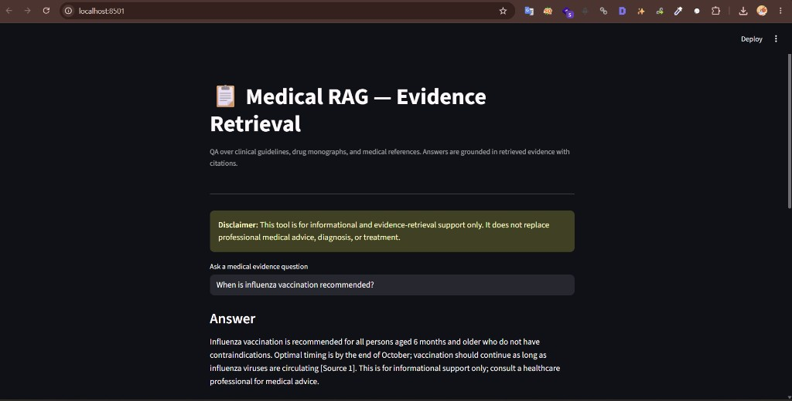
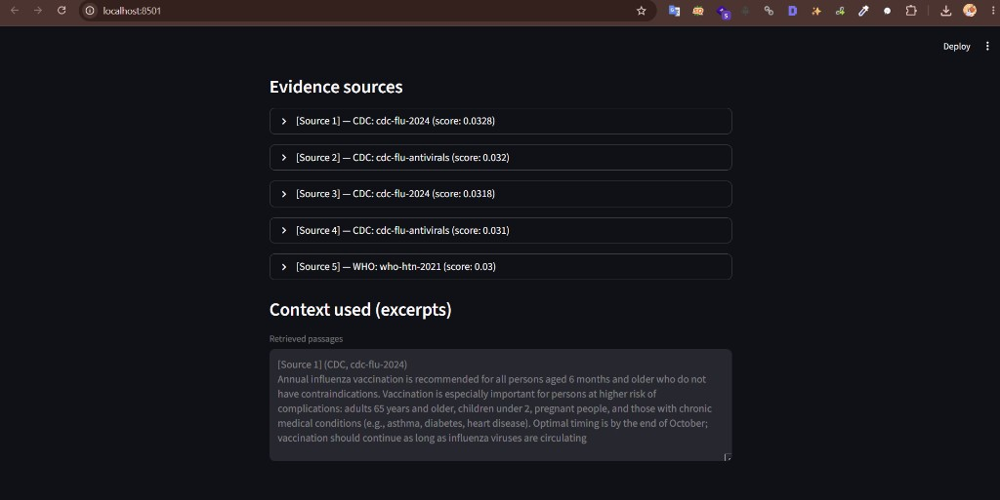

# Medical RAG — Evidence Retrieval

A Retrieval-Augmented Generation (RAG) system for medical evidence lookup and question answering over **clinical guidelines**, **drug monographs**, and **medical reference documents** with **source citations**.

This project is designed as a practical evidence-retrieval demo for medical and clinical information workflows. It focuses on traceable answers, hybrid search, and a safer generation layer that prefers evidence over free-form responses.

Generation runs **locally via [Ollama](https://ollama.com)** (default model: `qwen2.5-coder:3b`). No OpenAI API key is required.

## Demo

Streamlit UI answering a clinical evidence question with local Ollama:



Retrieved evidence sources and context excerpts used for the answer:



## Key features

- **Multiple knowledge sources**: clinical guidelines, drug monographs, and custom documents
- **Hybrid retrieval**: combines dense embeddings with BM25 lexical search
- **Reciprocal Rank Fusion (RRF)**: merges retrieval results into a single ranked list
- **Reranking**: optional cross-encoder reranker to improve final passage quality
- **Citations**: returns source-aware answers with references such as `[Source 1]`, `[Source 2]`
- **Local LLM**: answers generated with Ollama on your machine
- **Safety-first prompting**: encourages evidence-based responses and includes a clear medical disclaimer

## Project layout

```text
Medical_RAG/
├── config/
│   └── settings.yaml       # Embeddings, chunking, retrieval, and LLM settings
├── data/
│   ├── guidelines/         # CDC/WHO-style JSON or TXT files
│   ├── drug_monographs/    # DrugBank-style JSON files
│   ├── custom_docs/        # Optional PDF/TXT/MD files
│   └── chroma_db/          # Vector database created during ingestion
├── docs/
│   └── screenshots/        # Streamlit demo screenshots
├── src/
│   ├── config.py
│   ├── pipeline.py         # Builds the full RAG pipeline
│   ├── ingest/             # Loaders, chunking, and document handling
│   ├── retrieval/          # Embeddings, Chroma, hybrid search, reranking
│   └── generation/         # Prompts, RAG chain, and citations
├── scripts/
│   ├── run_ingest.py       # Ingests documents into the vector store
│   └── run_qa.py           # CLI question-answering entry point
├── app.py                  # Streamlit interface
├── requirements.txt
└── README.md
```

## Getting started

1. **Create a virtual environment and install dependencies**

   ```bash
   cd Medical_RAG
   pip install -r requirements.txt
   ```

2. **Install and run Ollama (local LLM)**

   Install [Ollama](https://ollama.com), then pull the model used by this project:

   ```bash
   ollama pull qwen2.5-coder:3b
   ```

   Confirm the model is available:

   ```bash
   ollama list
   ```

   The app talks to Ollama at `http://localhost:11434` by default (see `config/settings.yaml`). Keep the Ollama service running while you use the CLI or Streamlit UI.

3. **Ingest the sample corpus**

   The repository includes sample guidelines and drug monographs under `data/guidelines` and `data/drug_monographs`.

   ```bash
   python scripts/run_ingest.py
   ```

4. **Ask a question**

   CLI examples:

   ```bash
   python scripts/run_qa.py "When is influenza vaccination recommended?"
   python scripts/run_qa.py
   ```

   Streamlit UI:

   ```bash
   streamlit run app.py
   ```

## Configuration

Most project behavior is controlled from `config/settings.yaml`. You can adjust:

- **Embedding model** for retrieval quality (ONNX MiniLM by default)
- **Chunk size and overlap** for document splitting
- **Top-k values** for retrieval and reranking
- **LLM provider** and model name (default: `ollama` / `qwen2.5-coder:3b`)
- **Data paths** for your own guideline, drug, or custom document collections

To use a different local model, change `llm.model_name` in `config/settings.yaml` (for example `qwen3` or `qwen2.5-coder:7b`) after pulling it with `ollama pull`.

## Adding your own data

### Guidelines

Add JSON files to `data/guidelines/` with fields such as:

- `title`
- `source`
- `content` or `text`
- optional `id`

### Drug monographs

Add JSON files to `data/drug_monographs/` with fields such as:

- `name`
- `description`
- `indications`
- `mechanism`
- `contraindications`
- `interactions`
- `adverse_effects`
- `dosing`

### Custom documents

Place `.txt`, `.md`, or other supported files in `data/custom_docs/`.

After adding or changing documents, rerun ingestion:

```bash
python scripts/run_ingest.py
```

If the corpus changes significantly, clear or replace `data/chroma_db` before re-ingesting to avoid duplicate entries.

## Why these design choices

- **Hybrid search** improves recall by combining semantic matching with lexical matching, which is especially useful for medical terminology and guideline language.
- **RRF** keeps fusion simple and stable without requiring manual weighting.
- **Reranking** improves precision by promoting the most relevant passages before generation.
- **Evidence-first prompting** helps keep answers grounded in retrieved sources, which is important for decision-support style use cases.
- **Local Ollama** keeps generation private and offline—no cloud API key required.

## Testing

Run the test suite from the project root:

```bash
pytest tests/ -v -m "not slow"
```

## Notes

This project is intended for learning, portfolio work, and prototype evaluation. It is **not** a clinical decision system and should not be used for diagnosis, treatment, or regulatory use without proper validation, review, and compliance checks.

## License

Use for learning and portfolio purposes only.
